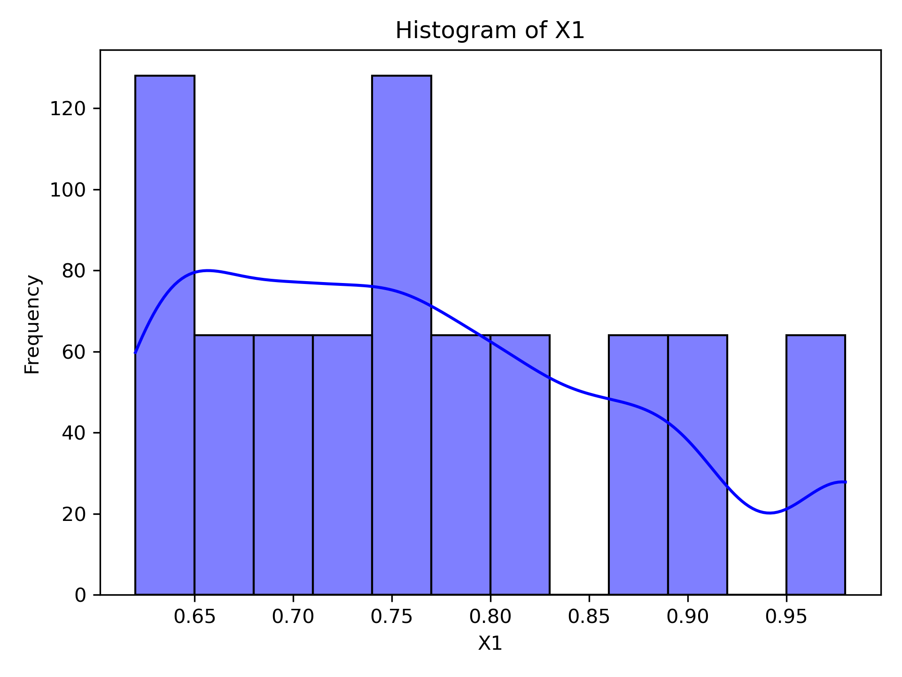
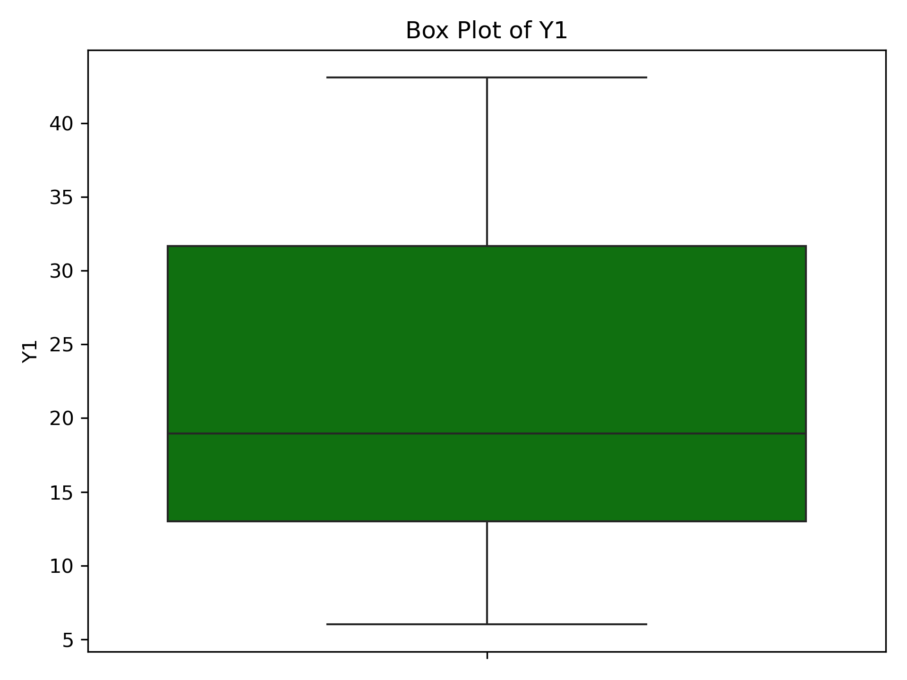
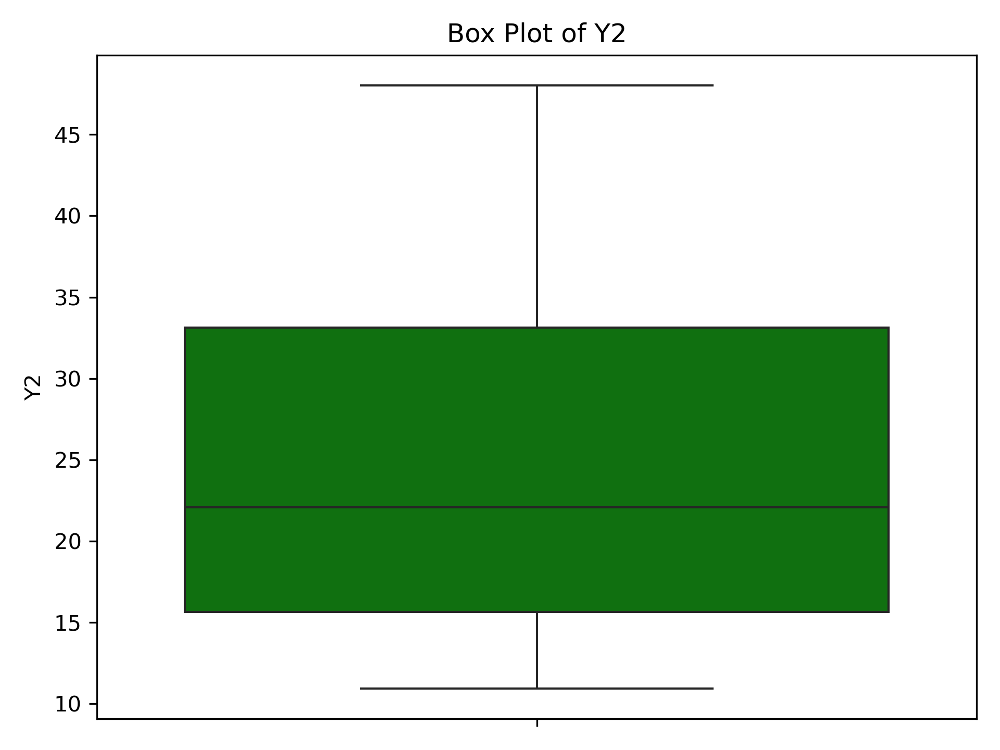
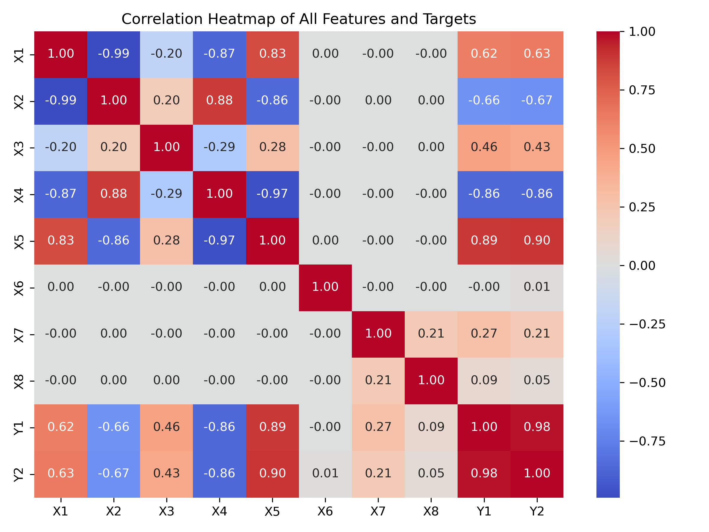
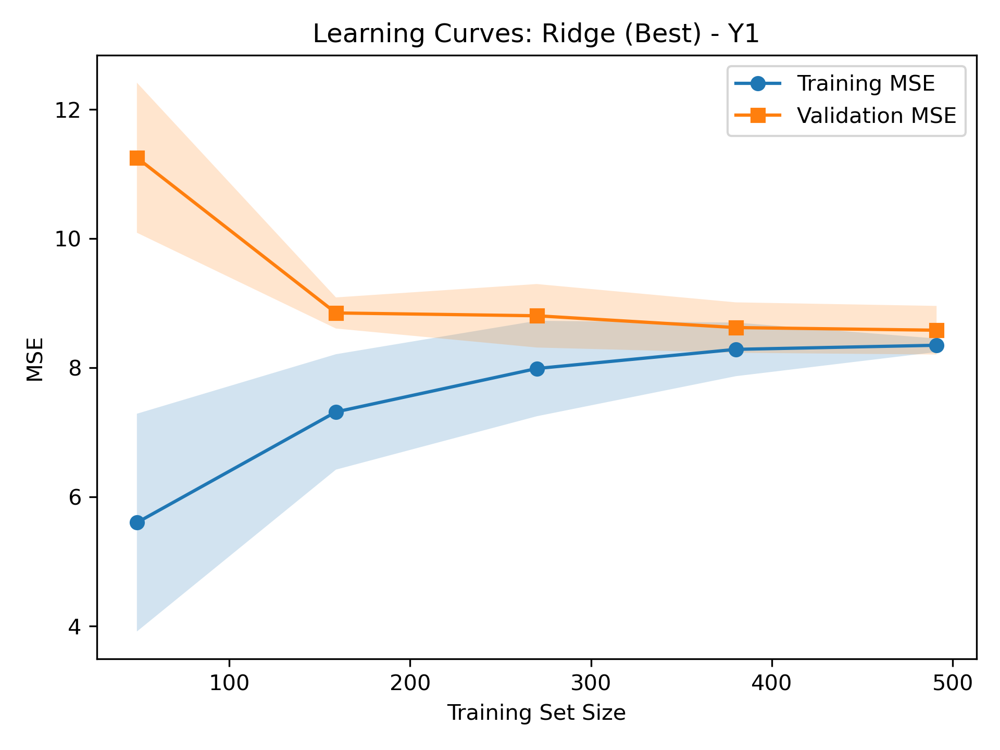
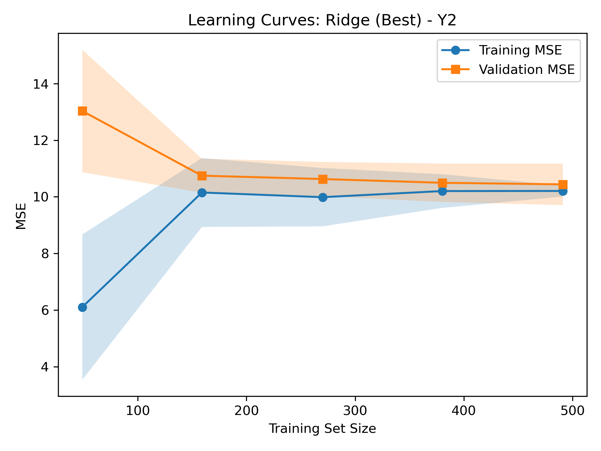
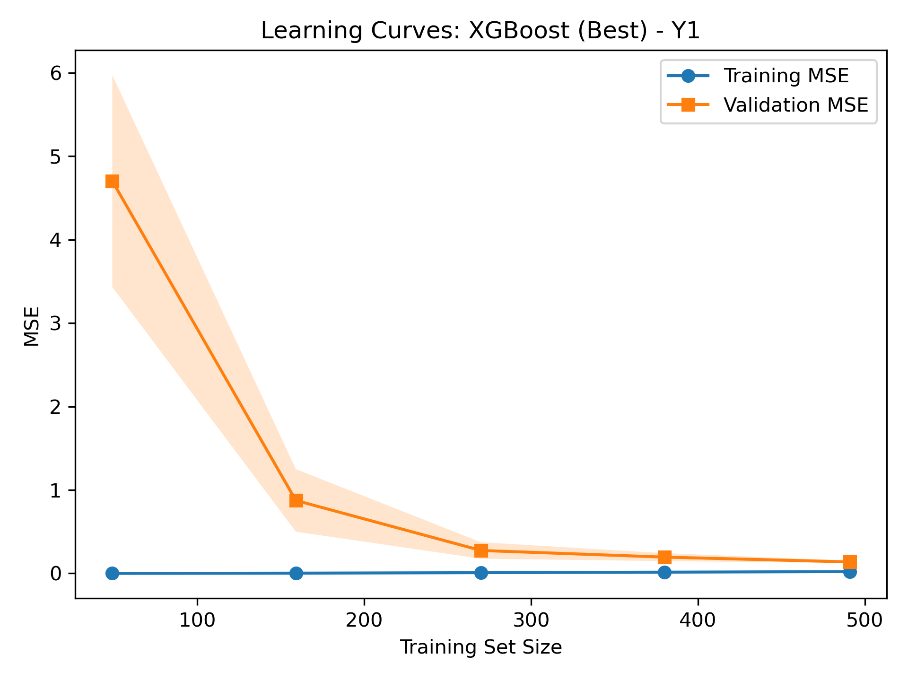
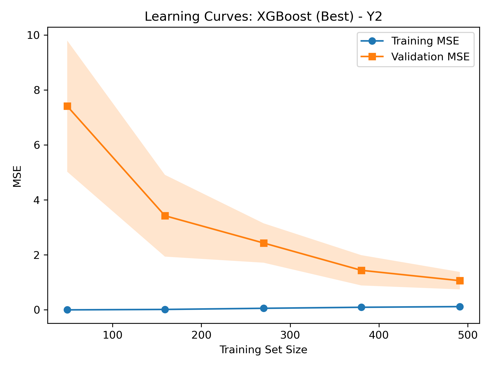

# Supervised Learning for Energy Efficiency
Author: Andrew Farell

Hello! In this project, I focus on predicting **heating and cooling loads** for residential buildings. My objective is to explore how different building features (like shape, surface area, and glazing) affect energy demands, aiming to help designers and architects optimize for efficiency.

---

## Problem Definition

I’m working with the **ENB2012 dataset**, which includes 768 building configurations simulated in Ecotect. Each configuration has eight features (X1–X8) and two target variables:

- **X1**: Relative Compactness  
- **X2**: Surface Area  
- **X3**: Wall Area  
- **X4**: Roof Area  
- **X5**: Overall Height  
- **X6**: Orientation  
- **X7**: Glazing Area  
- **X8**: Glazing Area Distribution  

The two targets are:

1. **Y1** (Heating Load)  
2. **Y2** (Cooling Load)  

By modeling these relationships, I gain a clearer picture of how building designs influence energy consumption. Although the dataset is primarily for **regression** tasks, it could be reframed as a classification problem if I rounded energy loads to whole numbers.

---

## Exploratory Data Analysis

Before diving into modeling, I explored the data to see how the features and targets behave. The outputs of this analysis are in the `outputs/` folder, along with a file called `analysis.json` that has key statistical information.

### 1. Data Integrity and Basic Statistics

- **No Missing Values**: I confirmed that none of the 768 rows contain missing data.  
- **Data Types**: Most features are floats (e.g., X1, X2, etc.), while X6 and X8 are integers. This matches the dataset’s official description.  
- **Descriptive Stats**: Here are some highlights (more details can be found in `analysis.json`):  
  - **Relative Compactness (X1)** varies from 0.62 to 0.98 (mean ~0.76).  
  - **Surface Area (X2)** ranges from 514.5 to 808.5, averaging around 671.71.  
  - **Heating Load (Y1)** spans 6.01 to 43.1 (mean ~22.31).  
  - **Cooling Load (Y2)** goes from 10.9 to 48.03 (mean ~24.59).  

### 2. Univariate Distributions

I created histograms for each feature and target to visualize their distributions. For example:

Similar images for X2 through Y2 (e.g., `X2_hist.png`, `Y1_hist.png`, etc.) are located in the `outputs/` directory. These plots help me see how each variable is spread out (e.g., X1 peaks near 0.75, X2 clusters around ~670 m²).

### 3. Target Variable Box Plots

To spot any outliers, I also plotted box plots for **Heating Load (Y1)** and **Cooling Load (Y2)**:

The box plots indicate that a subset of buildings require substantially higher energy, which likely ties to differences in surface area, height, orientation, or other design aspects.

### 4. Correlation Analysis

Finally, I examined feature correlations and how they relate to the targets:

Notable observations include:
- **X5 (Overall Height)** has a strong positive correlation with both Y1 (~0.89) and Y2 (~0.90). Taller buildings often need more energy for heating and cooling.  
- **X4 (Roof Area)** is strongly negatively correlated with both Y1 and Y2 (~-0.86 each). This likely reflects interactions between building height, roof surface, and thermal transfers.  
- **X1 (Relative Compactness)** also correlates well with Y1 and Y2, suggesting that more compact designs can reduce energy demands.

Collectively, these findings shape my approach to choosing and tuning predictive models.

---

## Modeling and Results

### 1. Model Definitions

I tested two types of models:

1. **Ridge Regression**  
   This is a linear regression model with \(\ell_2\) regularization. I used a pipeline to **scale the features** and fit a Ridge regressor, exploring multiple values of the regularization parameter \(\alpha\).

2. **XGBoost**  
   XGBoost is a gradient boosting library that can handle complex, nonlinear relationships. I tuned:
   - **learning_rate**: A step size parameter that helps avoid overfitting,  
   - **max_depth**: The maximum depth of each decision tree,  
   - **n_estimators**: The total number of boosting rounds (trees).

### 2. Loss Function and Metrics

Both models aim to **minimize Mean Squared Error (MSE)**:

\[
\mathrm{MSE} \;=\; \frac{1}{n}\sum_{i=1}^n (\hat{y}_i - y_i)^2,
\]

where \(y_i\) is the true heating or cooling load, and \(\hat{y}_i\) is my model’s prediction. I used **5-fold cross-validation** to find the best hyperparameters and then evaluated final performance on a separate test set.

### 3. Training Procedure

1. **Data Splitting**: I reserved 20% of the data for final testing to ensure the models don’t overfit by seeing all samples during training.  
2. **Scaling and Fitting**: I standardized the features (subtracting mean, dividing by std) and then trained each model on the remaining 80% of data.  
3. **Hyperparameter Grid Search**: I systematically varied \(\alpha\) (for Ridge) and learning_rate, max_depth, n_estimators (for XGBoost) across a range of values. The combination that achieved the lowest cross-validation MSE was then refit on the full training set.

### 4. Results Overview

I recorded **every** parameter combination’s average cross-validation MSE and test-set MSE in two CSV files:
- [`ridge_results.csv`](outputs/ridge_results.csv)  
- [`xgb_results.csv`](outputs/xgb_results.csv)  

These files list each tried hyperparameter setting, along with the corresponding errors. Checking them out lets you see which values of \(\alpha\) or tree depth worked best.

### 5. Learning Curves

I also plotted learning curves for the best-performing parameter settings on each model and target:

  
  
  

These graphs display **Training MSE** and **Validation MSE** as the training set size grows. A narrow gap between these lines usually indicates that the model generalizes well and isn’t overly complex.

### 6. Interpretation and Next Steps

- **Ridge Regression**: Offers a more straightforward, linear way to capture relationships. Its MSE is moderate, reflecting that while some linear patterns exist, the problem likely has deeper complexities.  
- **XGBoost**: Tends to produce substantially lower errors for both heating (Y1) and cooling (Y2) tasks, suggesting it can handle nonlinear interactions between building parameters.

If you want a model that’s easier to interpret, a linear approach like Ridge may be appropriate. However, for raw predictive power, XGBoost is a strong choice. Additional analysis—such as examining **feature importances**—could help me see exactly which design choices drive energy usage the most.

This study how building geometry, orientation, and glazing can significantly influence energy demands. Feel free to explore new features, optimize your hyperparameters further, or even compare these methods against other algorithms like random forests or neural networks to see if you can improve results.
